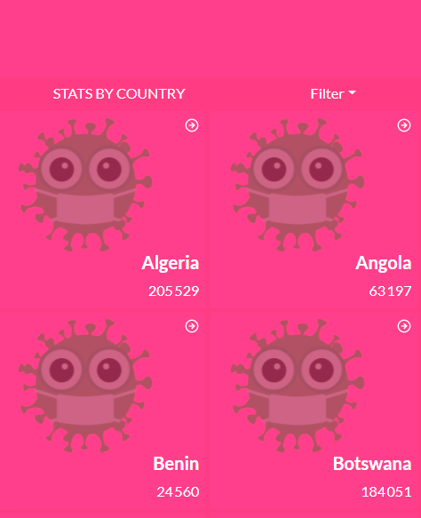

# COVID19 Metrics App
This application collects data from an API about coronavirus in Africa. Real live data is obtained from the MMediaGroup API.

### Home page




## Built With

- ReactJS
- Redux
- React Bootstrap
- Git 

## Live demo

[COVID-19 App Demo](https://covid19-metrics-app-aka.netlify.app/)

## Live Video 


[Loom](https://www.loom.com/share/ed5f10ee5a29485f9767e57d35bedb2c)

## Getting Started

### To get a local copy run the following steps:

Please get your browser update.

. Step 1:  To get a local copy up and running follow these simple steps.
   ```
   git clone <URL> in your terminal
   ```

. Step 2: 
   ```
   cd metrics-app-covid19

   npm install

   npm run build

   npm start 
   ```

. Step 3: Test 
   ```
   npm test 
   ```


## Authors

👤 **Yannick-Noel AKA**

- Location: Côte d'Ivoire
- GitHub: [@codecaiine](https://github.com/codecaiine)
- Twitter: [@yannicknaka](https://twitter.com/yannicknaka)
- LinkedIn: [LinkedIn](https://www.linkedin.com/in/yannick-no%C3%ABl-aka/)

## 🤝 Contributing

Contributions, issues, and feature requests are welcome!

Feel free to check the [issues page](https://github.com/codecaiine/metrics-app-covid19/issues).

## Show your support

Give a ⭐️ if you like this project!

## Acknowledgments

- Learning partners, Standup and morning session team
- [Nelson Sakwa on Behance](https://www.behance.net/sakwadesignstudio) (Project Design from [Behance](https://www.behance.net/gallery/31579789/Ballhead-App-(Free-PSDs)))
- [M-Media-Group/Covid-19-API](https://github.com/M-Media-Group/Covid-19-API)
